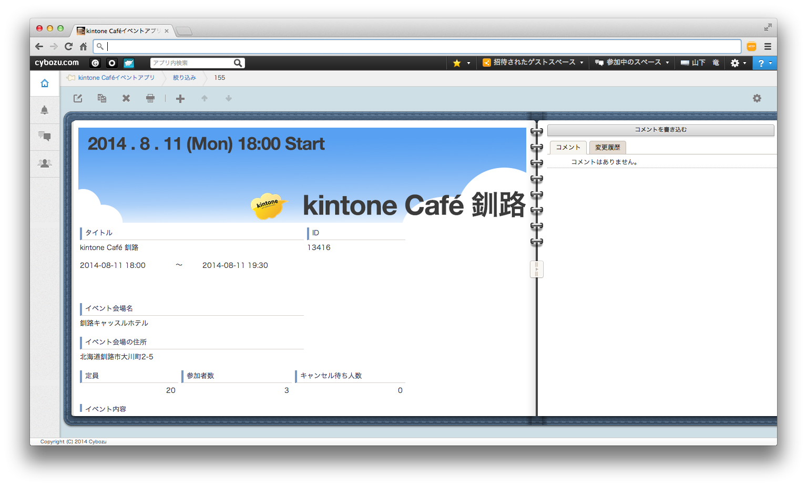

# kintone Café イベントアプリ（Doorkeeperコミュニティ連携）

　「kintone Café イベントアプリ」はDoorkeeperの「kinotne Café」コミュニティのイベント情報を取得して一覧化するアプリです。kintone JavaScript APIのkintone.proxy()とDoorkeeper APIを利用しています。
　アプリテンプレートとJavaScriptは「kinotne Café」用のものをデプロイしていますが、グループ（コミュニティ）名を変えることで、他のグループでの活用も可能です。

## Example

## インストール
zip形式のアプリテンプレート`template.zip` をこのページからダウンロードして、kintoneにインポートしてください。

**(NOTICE)** `template.zip`が壊れないようにダウンロード頂くには、 `kintone-JS` レポジトリを一括ダウンロード頂くのが良いかと思います。

## ライセンス
MIT license

## Doorkeeperオフィシャル情報

* Official page: [Doorkeeper API](http://www.doorkeeperhq.com/developer/api)
* Provider : Doorkeeper Inc.
* License : -