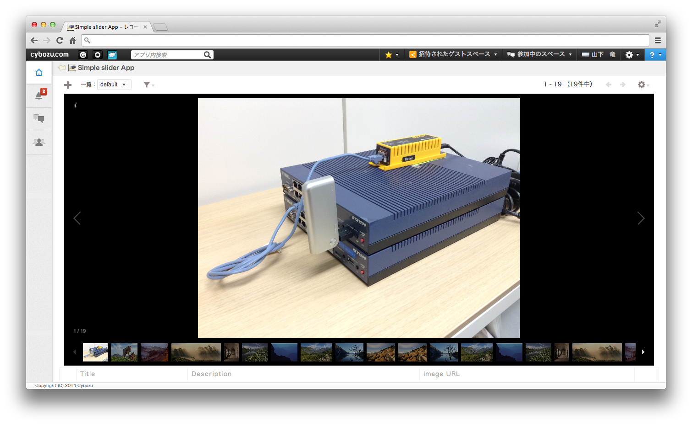

# Simple slider

"Simple slider" is a kintone application for creating simple image galleries. This is composed of kintone's original API functions and a JavaScript library, "Galleria". 

## Example

## Installation & Trial
You can download a zipped template application, `template.zip` from this page, and then import into your kintone.

I'll also provide a sample CSV file, `sampleRecords.csv` (UTF-8) for importing. So you can try immediately.

**(NOTICE)** You should download a `kintone-JS` repository all while you get `template.zip` so as not to be corrupted!

## Embeded media
You can embed image files.

## License
I'll provide these sample application and sources under the MIT license. I use a "Classic" theme released under the MIT License originally.

## Galleria official information

* Official page: [Galleria](http://galleria.io/), [GitHub](https://github.com/aino/galleria/)
* Provider : Galleria
* License : "Classic" theme released under the MIT License