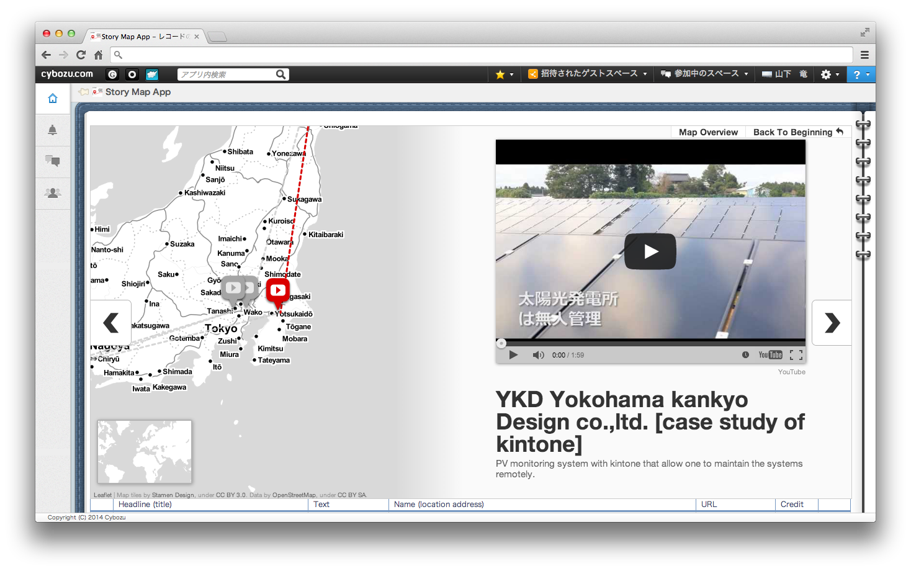

# Story Map

"Story Map" is a kintone application for creating maps telling stories. This is composed of kintone's original API functions and a JavaScript library, "StoryMap JS". 

## Example

## Installation & Trial
You can download a zipped template application, `template.zip` from this page, and then import into your kintone.

I'll also provide a sample CSV file, `sampleRecord.csv` (UTF-8) for importing. So you can try immediately.

## Embeded media
You can embed rich media service, YouTube, Vine, Flickr, Picasa, and more. These are delivered under HTTPS conditions.

(NOTICE) Vimeo, Twitter, Wikipedia were blocked in my tests.

## License
I'll provide these sample application and sources under the MIT license.

## StoryMap JS official information

* Official page: [StoryMap JS](http://storymap.knightlab.com/), [GitHub](https://github.com/NUKnightLab/StoryMapJS/)
* Provider : NU Knight Lab
* License : MIT License